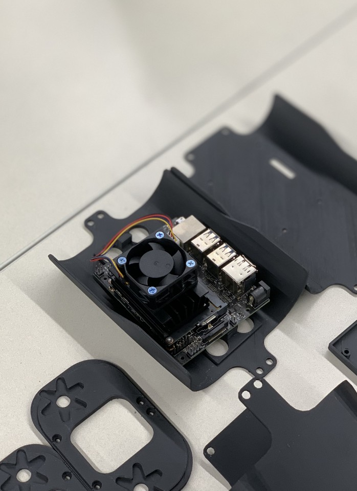
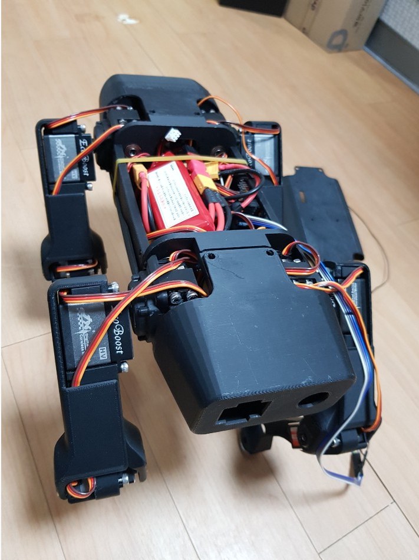
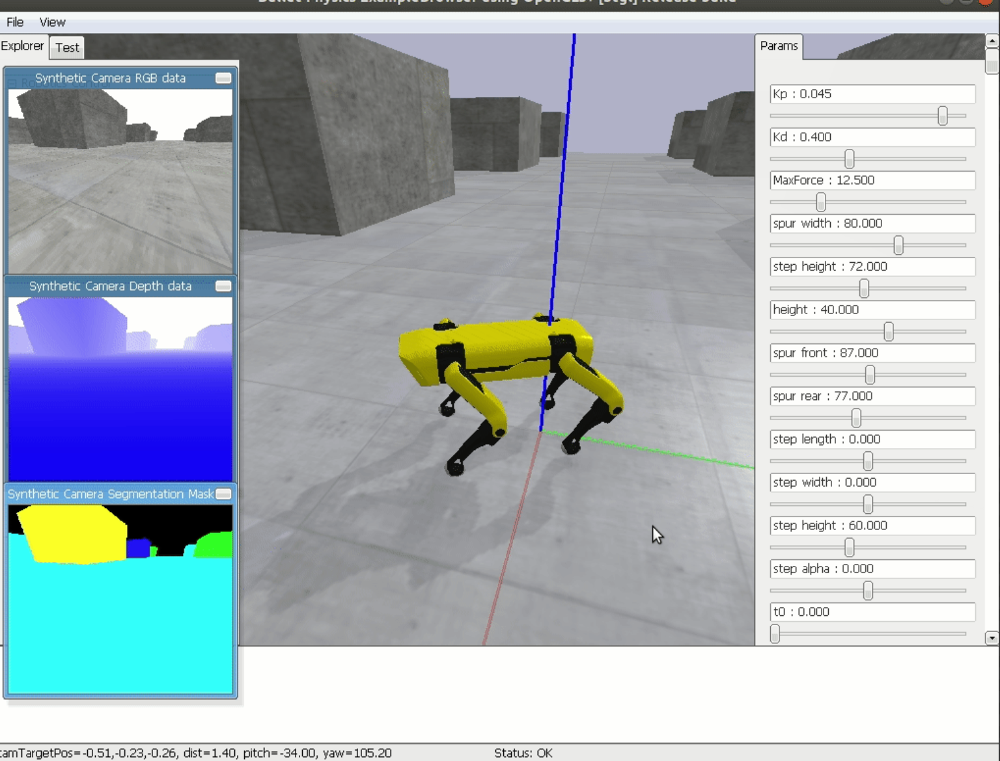

# SpotMicroAI - Road Balance version

## Abstract:

Let's build quadruped robot. Only requires few low-cost parts and this repository :)

## Hardware:

    

The hardware for SpotMicroAI is designed to be both aesthetically pleasing as well as easily obtainable and readily available. Wherever possible standard screws, bolts, and bearings are used. Standard hobby grade servos are currently used for locomotion in development however, they don't appear to have sufficient power to drive the robot at more than the slowest speeds. Other options are currently being investigated (including high-voltage and brushless hobby servos typically used with RC cars) which we hope will lead to a balance between an economical as well as robust robot.

The vast majority of the hardware by volume is designed to be 3D printed. So far complete prints have been successful in PLA, though no technical barriers should exist to printing the robot in other material such as PETG, nylon, ABS, etc. The majority of parts require significant supports to print.

The files available both as STL and STP. As a community we have not yet settled on a servo for this project and therefore multiple versions of the hardware exist to support the physical dimensions of the servos and their respective servo horns. For the most up-to-date version of the hardware please visit: [https://www.thingiverse.com/thing:3761340](https://www.thingiverse.com/thing:3761340). Please see documentation for details as to which files correspond to which servo.

> BOM for Korean Commerce is added and here's the [google spreadsheet link](https://docs.google.com/spreadsheets/d/1UIJ1a0tUQx4ky75Ovr97hnKy3tkcdXQCYJl6zFl0juA/edit?usp=sharing)

## Electronics:

    

The `Jetson Nano` operates at 5v, and the `PCA9658` for driving the servomotor operates at 6v. In this project, the electronic department was constructed using 7.9v LiPo batteries and `LM2596` DC Converter.

## PyBullet Simulation:

Before making the actual robot, we recommend experimenting with the kinematics and walking mechanism of the robot through simulation, and added a simulated environment built with pybullets to this end.

The walking mechanism can be understood through the adjustment of several parameters in simulation, and SpotMicro can also be controlled by the keyboard.

## Real Robots

Finally, it's time to have a real robot and run it. Before uploading and operating the software after assembly, the debugging points such as calibration, center of gravity, and component placement of servo motor are organized and written in Readme file.

---

## Reference && Community

This repository originally forked from [FlorianWilk's Jetson Nano SpotMicro Project](https://github.com/FlorianWilk/SpotMicroAI)

COMPLETE DOCUMENTATION AND GETTING STARTED GUIDES CAN BE FOUND AT:
[https://spotmicroai.readthedocs.io/en/latest/](https://spotmicroai.readthedocs.io/en/latest/)

[spotmicroai.readthedocs.io](http://spotmicroai.readthedocs.io)

The best place to get started is to read the getting started documentation at [spotmicroai.readthedocs.io](spotmicroai.readthedocs.io). The documentation will eventually contain a complete tutorial for building a SpotMicroAI including where to source components, links to most recent 3D files for printing, assembly, and installing the software. It's being updated as we go.

For questions or more information please see the [Forums at SpotMicroAI.org](http://SpotMicroAI.org), or asked on slack. Join our slack at: [https://spotmicroai-inviter.herokuapp.com/](https://spotmicroai-inviter.herokuapp.com/)

BostonDynamics Spot robot: https://www.youtube.com/watch?v=wlkCQXHEgjA

Can you make it dance? join the challenge: https://www.youtube.com/watch?v=kHBcVlqpvZ8&list=PLp5v7U2tXHs3BYfe93GZwuUZLGsisapic&index=2

Original idea by KDY0523 https://www.thingiverse.com/thing:3445283

Some of the community videos: https://www.youtube.com/playlist?list=PLp5v7U2tXHs3BYfe93GZwuUZLGsisapic

* Join us in Slack: https://spotmicroai-inviter.herokuapp.com/
* Documentation: https://spotmicroai.readthedocs.io
* Forum http://spotmicroai.org/

This is the repository for simulation code, usually in combination with nVIDIA Jetson Nano board, of SpotMicro project.

In here you can find all the project repositories: **https://gitlab.com/custom_robots/spotmicro**

### Community:
The primary community discussions take place on SpotMicro.org. The message boards there contain a repository of topics which span hardware and software.

Real-time question-and-answer (or as close to real time as is possible when run by volunteers with full-time jobs and families) can happen on slack (LINK coming soon).

Other questions occasionally surface on other location such as on Thingiverse or on robotshop.com. We do our best answers these as we see them, but if you want to be heard the best way is either on SpotMicro.org or on slack.

As a community we do have some small expenses such as web hosting fees and occasional developing fees. In the future, we would also like to hold events and competitions. To anyone who finds enjoyment or education in this project we appreciate the financial support you're able to give. Donations coming soon.

All donations stay in the community and go towards future development.

If you use this worker will any work derived from it in academic publication please cite it as: *insert citation here*.
